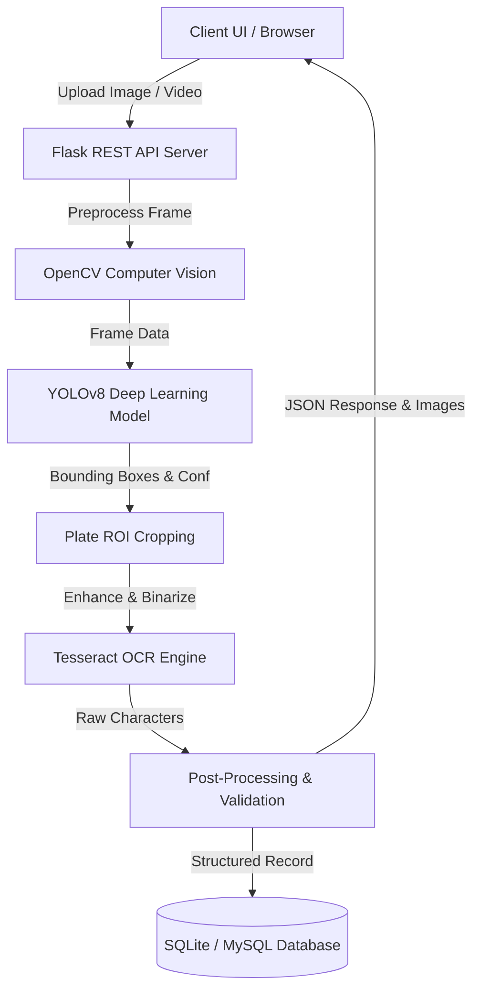

# 🚗 AutoPlate AI - Vehicle Number Plate Detection & Recognition Using Deep Learning

A full-stack, state-of-the-art web application for **Automatic License Plate Recognition (ALPR)** powered by **YOLOv8**, **OpenCV**, **Tesseract OCR**, and a **Python Flask** REST backend with **SQLite/MySQL** database persistence.

---

## 🌟 Key Features

- **⚡ Deep Learning Detection**: YOLOv8 deep learning model for real-time bounding-box localization of vehicle number plates.
- **🔬 Computer Vision Preprocessing**: OpenCV pipeline applying intelligent image resizing, Gaussian blur noise filtering, adaptive binarization, and morphological closure.
- **🔤 Optical Character Recognition (OCR)**: Tesseract OCR configured with LSTM engines and alphanumeric character filters for high recognition accuracy.
- **✨ Post-Processing & Validation**: Automated regex-based license plate formatting and validation against national vehicle registration standards.
- **📊 Real-Time Dashboard**: Modern, responsive glassmorphism UI with live preview, laser scanning animation, technical metric cards, and inspection modals.
- **🗄️ Database Logging**: Automatic storage of detection records, timestamps, confidence scores, cropped plates, and annotated vehicle images.
- **🎬 Image & Video Support**: Supports both static photos (JPG, PNG, WEBP) and video files (MP4, AVI, MOV) with keyframe sampling.

---

## 🏗️ System Architecture



---

## 🛠️ Technology Stack

| Layer | Technology | Purpose |
|---|---|---|
| **Frontend** | HTML5, CSS3 (Vanilla), JavaScript (ES6+) | Modern, glassmorphic, responsive user interface |
| **Backend API** | Python, Flask, Flask-CORS | REST API handling uploads, processing, and serving |
| **Deep Learning** | YOLOv8 (Ultralytics, PyTorch) | High-speed vehicle license plate object detection |
| **Computer Vision** | OpenCV (`cv2`), NumPy, Pillow | Image transformation, bounding box rendering, ROI cropping |
| **OCR Engine** | Tesseract OCR (`pytesseract`) | Character extraction from cropped license plate regions |
| **Database** | SQLite3 / MySQL | Persistent logging of detection history and paths |
| **Development** | VS Code, PowerShell | Development environment & execution |

---

## 📂 Project Structure

```
vehicle-number-plate/
│
├── frontend/
│   ├── index.html          # Modern HTML5 dashboard UI
│   ├── style.css           # Glassmorphic CSS design system
│   └── script.js           # Frontend logic & Flask API integration
│
├── backend/
│   ├── app.py              # Flask REST API and file server
│   ├── detection.py        # YOLOv8 model loading, inference & cropping
│   ├── ocr.py              # OpenCV preprocessing & Tesseract OCR pipeline
│   ├── database.py         # SQLite database initialization and operations
│   ├── model/
│   │   ├── README.md       # Model weights placement guide
│   │   └── best.pt         # Trained YOLO model weights
│   ├── uploads/            # Temporary storage for uploaded media
│   └── results/            # Saved cropped plates & annotated scenes
│
├── dataset/
│   ├── data.yaml           # YOLOv8 dataset configuration file
│   ├── README.md           # Dataset formatting and structure guide
│   ├── images/             # Training and validation images
│   └── labels/             # YOLO bounding box label txt files
│
├── train_yolo.py           # One-click custom YOLO training script
├── requirements.txt        # Python backend dependencies
└── README.md               # Complete project documentation
```

---

## 🚀 Getting Started & Installation

### Step 1: Clone or Navigate to the Project Directory
```powershell
cd "a:\ai trafic"
```

### Step 2: Install Tesseract OCR (Windows)
1. Download the Windows installer from [UB-Mannheim Tesseract OCR](https://github.com/UB-Mannheim/tesseract/wiki).
2. Run the installer and install to the default location: `C:\Program Files\Tesseract-OCR`.
3. AutoPlate AI includes auto-detection for standard paths, or you can add `C:\Program Files\Tesseract-OCR` to your Windows Environment `PATH`.

*(For Linux/Ubuntu: `sudo apt-get install tesseract-ocr`)*

### Step 3: Set up Python Virtual Environment (Recommended)
```powershell
# Create virtual environment
python -m venv venv

# Activate virtual environment (Windows PowerShell)
.\venv\Scripts\Activate.ps1
```

### Step 4: Install Dependencies
```powershell
pip install -r requirements.txt
```

---

## 💻 Running the Application

### Option A: Single-Command Run (Recommended)
You can run both the backend API and frontend together using Flask:

```powershell
python backend/app.py
```

Then open your browser and go to:
👉 **[http://127.0.0.1:5000/](http://127.0.0.1:5000/)**

### Option B: Running with VS Code Live Server (Independent Frontend)
1. Start the Flask backend:
   ```powershell
   python backend/app.py
   ```
2. Open `frontend/index.html` in VS Code.
3. Right-click and select **"Open with Live Server"** (or open `frontend/index.html` directly in your browser).
4. The frontend will automatically connect to the backend running at `http://127.0.0.1:5000`.

---

## 🎯 Training Your Custom YOLO Model

To train a YOLOv8 model on your custom vehicle dataset:

1. Organize your labeled dataset inside the `dataset/` directory according to `dataset/data.yaml`.
2. Run the training script:
   ```powershell
   python train_yolo.py
   ```
3. When training finishes, the best model weights are automatically placed at `backend/model/best.pt`.

---

## 📡 REST API Endpoints

| Method | Endpoint | Description |
|---|---|---|
| `GET` | `/` | Serves the frontend web dashboard |
| `GET` | `/api/health` | Health-check endpoint verifying backend status |
| `POST` | `/api/detect-image` | Upload image file (multipart/form-data) for YOLO + OCR analysis |
| `POST` | `/api/detect-video` | Upload video file (multipart/form-data) for frame-sampling analysis |
| `GET` | `/api/history` | Retrieves the latest 50 detection records from the database |
| `DELETE` | `/api/history/clear` | Clears all detection records from the database |
| `GET` | `/results/<filename>` | Serves generated output images (annotated / cropped) |
| `GET` | `/uploads/<filename>` | Serves uploaded original input media |

---

## 🗃️ Database Schema

The system logs every detection event into SQLite (`detections.db`):

| Column | Type | Description |
|---|---|---|
| `id` | `INTEGER PRIMARY KEY` | Auto-incrementing detection record identifier |
| `vehicle_number` | `TEXT` | Recognized and post-processed license plate text |
| `confidence_score` | `REAL` | YOLO detection confidence percentage (0.0 to 1.0) |
| `detection_date` | `TEXT` | Date of detection (`YYYY-MM-DD`) |
| `detection_time` | `TEXT` | Time of detection (`HH:MM:SS`) |
| `original_image_path` | `TEXT` | Filename of the uploaded vehicle image/frame |
| `cropped_plate_path` | `TEXT` | Filename of the cropped & enhanced plate image |

---

## 👨‍💻 Project Demonstration Checklist

- [x] Modern responsive UI with Cyber-Dark / Glassmorphic styling
- [x] Dual Image and Video upload modes with drag-and-drop
- [x] Real-time neural inference scanning animation
- [x] YOLOv8 bounding-box visualization
- [x] OpenCV ROI extraction and multi-stage binarization
- [x] Tesseract OCR character recognition with custom whitelist
- [x] Registration number validation & regex cleaning
- [x] Full database logging & history viewer with search/filter
- [x] Modal image viewer for high-resolution inspection
- [x] Complete setup instructions for academic / mini-project evaluation
