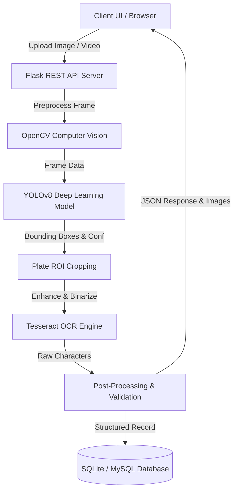

# AI-Theft-Vehicle-Tracke
# 🚗 AI Theft Vehicle Tracker

> **AI-powered vehicle theft detection, tracking, and alert system**

AI Theft Vehicle Tracker is an intelligent security platform designed to detect suspicious vehicle movement, identify stolen vehicles using number-plate recognition, track authorized vehicles using GPS/IoT devices, and generate real-time alerts.

## 🎯 Problem Statement

Vehicle theft is a major security problem. Traditional GPS trackers can provide location information, but they generally do not provide intelligent theft detection or automated vehicle identification.

This project combines **AI + Computer Vision + GPS + IoT + Real-Time Monitoring** to create a smarter vehicle security system.

## 💡 Solution

The system combines:

* 🤖 AI-based vehicle detection
* 🔢 Automatic Number Plate Recognition (ANPR)
* 📍 GPS-based vehicle tracking
* 🚨 Theft and tamper detection
* 🗺️ Real-time location monitoring
* 🧠 AI-powered risk analysis
* 🔔 Real-time alerts
* 📊 Security dashboard

## 🏗️ System Architecture

```text
                    ΓöîΓöÇΓöÇΓöÇΓöÇΓöÇΓöÇΓöÇΓöÇΓöÇΓöÇΓöÇΓöÇΓöÇΓöÇΓöÇΓöÇΓöÇΓöÉ
                    Γöé   CCTV / Camera Γöé
                    ΓööΓöÇΓöÇΓöÇΓöÇΓöÇΓöÇΓöÇΓöÇΓö¼ΓöÇΓöÇΓöÇΓöÇΓöÇΓöÇΓöÇΓöÇΓöÿ
                             Γöé
                             Γû╝
                    ΓöîΓöÇΓöÇΓöÇΓöÇΓöÇΓöÇΓöÇΓöÇΓöÇΓöÇΓöÇΓöÇΓöÇΓöÇΓöÇΓöÇΓöÇΓöÉ
                    Γöé Vehicle DetectionΓöé
                    Γöé     YOLO        Γöé
                    ΓööΓöÇΓöÇΓöÇΓöÇΓöÇΓöÇΓöÇΓöÇΓö¼ΓöÇΓöÇΓöÇΓöÇΓöÇΓöÇΓöÇΓöÇΓöÿ
                             Γöé
                             Γû╝
                    ΓöîΓöÇΓöÇΓöÇΓöÇΓöÇΓöÇΓöÇΓöÇΓöÇΓöÇΓöÇΓöÇΓöÇΓöÇΓöÇΓöÇΓöÇΓöÉ
                    Γöé ANPR + OCR      Γöé
                    Γöé Number Plate    Γöé
                    ΓööΓöÇΓöÇΓöÇΓöÇΓöÇΓöÇΓöÇΓöÇΓö¼ΓöÇΓöÇΓöÇΓöÇΓöÇΓöÇΓöÇΓöÇΓöÿ
                             Γöé
                             Γû╝
              ΓöîΓöÇΓöÇΓöÇΓöÇΓöÇΓöÇΓöÇΓöÇΓöÇΓöÇΓöÇΓöÇΓöÇΓöÇΓöÇΓöÇΓöÇΓöÇΓöÇΓöÇΓöÇΓöÇΓöÇΓöÇΓöÇΓöÇΓöÉ
              Γöé      AI Risk Engine      Γöé
              ΓööΓöÇΓöÇΓöÇΓöÇΓöÇΓöÇΓöÇΓöÇΓöÇΓöÇΓöÇΓöÇΓö¼ΓöÇΓöÇΓöÇΓöÇΓöÇΓöÇΓöÇΓöÇΓöÇΓöÇΓöÇΓöÇΓöÇΓöÿ
                           Γöé
             ΓöîΓöÇΓöÇΓöÇΓöÇΓöÇΓöÇΓöÇΓöÇΓöÇΓöÇΓöÇΓöÇΓöÇΓö┤ΓöÇΓöÇΓöÇΓöÇΓöÇΓöÇΓöÇΓöÇΓöÇΓöÇΓöÇΓöÇΓöÇΓöÉ
             Γû╝                           Γû╝
      ΓöîΓöÇΓöÇΓöÇΓöÇΓöÇΓöÇΓöÇΓöÇΓöÇΓöÇΓöÇΓöÇΓöÇΓöÇΓöÉ            ΓöîΓöÇΓöÇΓöÇΓöÇΓöÇΓöÇΓöÇΓöÇΓöÇΓöÇΓöÇΓöÇΓöÇΓöÇΓöÉ
      Γöé Stolen VehicleΓöé            Γöé GPS / IoT    Γöé
      Γöé Database      Γöé            Γöé Tracker      Γöé
      ΓööΓöÇΓöÇΓöÇΓöÇΓöÇΓöÇΓö¼ΓöÇΓöÇΓöÇΓöÇΓöÇΓöÇΓöÇΓöÿ            ΓööΓöÇΓöÇΓöÇΓöÇΓöÇΓöÇΓö¼ΓöÇΓöÇΓöÇΓöÇΓöÇΓöÇΓöÇΓöÿ
             Γöé                           Γöé
             ΓööΓöÇΓöÇΓöÇΓöÇΓöÇΓöÇΓöÇΓöÇΓöÇΓöÇΓöÇΓöÇΓöÇΓö¼ΓöÇΓöÇΓöÇΓöÇΓöÇΓöÇΓöÇΓöÇΓöÇΓöÇΓöÇΓöÇΓöÇΓöÿ
                           Γû╝
                  ΓöîΓöÇΓöÇΓöÇΓöÇΓöÇΓöÇΓöÇΓöÇΓöÇΓöÇΓöÇΓöÇΓöÇΓöÇΓöÇΓöÇΓöÇΓöÉ
                  Γöé Alert Engine     Γöé
                  ΓööΓöÇΓöÇΓöÇΓöÇΓöÇΓöÇΓöÇΓöÇΓö¼ΓöÇΓöÇΓöÇΓöÇΓöÇΓöÇΓöÇΓöÇΓöÿ
                           Γû╝
             ΓöîΓöÇΓöÇΓöÇΓöÇΓöÇΓöÇΓöÇΓöÇΓöÇΓöÇΓöÇΓöÇΓöÇΓöÇΓöÇΓöÇΓöÇΓöÇΓöÇΓöÇΓöÇΓöÇΓöÇΓöÇΓöÇΓöÉ
             Γöé Owner / Security       Γöé
             Γöé Monitoring Dashboard   Γöé
             ΓööΓöÇΓöÇΓöÇΓöÇΓöÇΓöÇΓöÇΓöÇΓöÇΓöÇΓöÇΓöÇΓöÇΓöÇΓöÇΓöÇΓöÇΓöÇΓöÇΓöÇΓöÇΓöÇΓöÇΓöÇΓöÇΓöÿ
```

## 🔥 Key Features

### 1. Vehicle Detection

Detect vehicles from CCTV/video streams using computer vision.

Supported detection can include:

* Cars
* Motorcycles
* Buses
* Trucks
* Other configured vehicle classes

### 2. Number Plate Recognition

The system extracts vehicle registration numbers from camera footage using:

```text
Camera
   Γåô
Vehicle Detection
   Γåô
Number Plate Detection
   Γåô
OCR
   Γåô
Registration Number
```

### 3. Stolen Vehicle Matching

Detected registration numbers are compared against an authorized test database.

```text
Detected Plate
      Γåô
Normalize Plate
      Γåô
Database Search
      Γåô
Match?
 ΓöîΓöÇΓöÇΓöÇΓöÇΓö┤ΓöÇΓöÇΓöÇΓöÇΓöÉ
YES       NO
 Γåô         Γåô
ALERT     NORMAL
```

### 4. GPS Tracking

An authorized IoT tracker can periodically transmit:

* Latitude
* Longitude
* Timestamp
* Device status
* Speed
* Movement status

### 5. Geofencing

Define an authorized geographical area.

Example:

```text
Vehicle enters allowed zone
        Γåô
       SAFE

Vehicle leaves zone
        Γåô
   Suspicious Event
        Γåô
     AI Analysis
        Γåô
      Alert
```

### 6. Tamper Detection

The system can detect suspicious tracker/device events such as:

* Unexpected device disconnect
* Tracker offline
* Sudden movement
* GPS signal interruption
* Unauthorized movement

### 7. AI Risk Score

The system generates a risk level based on multiple signals.

| Risk        | Example                             |
| ----------- | ----------------------------------- |
| 🟢 LOW      | Normal vehicle movement             |
| 🟡 MEDIUM   | Geofence violation                  |
| 🟠 HIGH     | Suspicious movement + tracker event |
| 🔴 CRITICAL | Stolen-vehicle database match       |

### 8. Real-Time Dashboard

Dashboard can display:

* Vehicle status
* Current location
* Last known location
* Number plate
* Risk score
* Alerts
* Movement history
* Camera detections
* Device health

## 🧠 AI Pipeline

```text
Video Stream
     Γåô
YOLO Vehicle Detection
     Γåô
Vehicle Tracking
     Γåô
Plate Detection
     Γåô
OCR
     Γåô
Plate Normalization
     Γåô
Database Matching
     Γåô
Risk Analysis
     Γåô
Alert Generation
```

## 🛠️ Technology Stack

### Frontend

* React.js
* Tailwind CSS
* JavaScript / TypeScript
* Map integration
* WebSocket client

### Backend

* Python
* FastAPI
* REST API
* WebSockets

### AI / Computer Vision

* YOLO
* OpenCV
* OCR
* NumPy
* PyTorch

### Database

* PostgreSQL
* Supabase

### IoT

* ESP32
* GPS module
* Optional vehicle sensors

### Infrastructure

* Docker
* GitHub
* Cloud deployment
* HTTPS

## 📁 Project Structure

```text
ai-theft-vehicle-tracker/
Γöé
Γö£ΓöÇΓöÇ frontend/
Γöé   Γö£ΓöÇΓöÇ src/
Γöé   Γö£ΓöÇΓöÇ components/
Γöé   Γö£ΓöÇΓöÇ pages/
Γöé   ΓööΓöÇΓöÇ services/
Γöé
Γö£ΓöÇΓöÇ backend/
Γöé   Γö£ΓöÇΓöÇ app/
Γöé   Γöé   Γö£ΓöÇΓöÇ main.py
Γöé   Γöé   Γö£ΓöÇΓöÇ api/
Γöé   Γöé   Γö£ΓöÇΓöÇ models/
Γöé   Γöé   Γö£ΓöÇΓöÇ services/
Γöé   Γöé   ΓööΓöÇΓöÇ database/
Γöé   Γöé
Γöé   ΓööΓöÇΓöÇ requirements.txt
Γöé
Γö£ΓöÇΓöÇ ai/
Γöé   Γö£ΓöÇΓöÇ vehicle_detection/
Γöé   Γö£ΓöÇΓöÇ plate_detection/
Γöé   Γö£ΓöÇΓöÇ ocr/
Γöé   ΓööΓöÇΓöÇ risk_engine/
Γöé
Γö£ΓöÇΓöÇ iot/
Γöé   Γö£ΓöÇΓöÇ esp32/
Γöé   ΓööΓöÇΓöÇ gps/
Γöé
Γö£ΓöÇΓöÇ database/
Γöé   ΓööΓöÇΓöÇ schema.sql
Γöé
Γö£ΓöÇΓöÇ docs/
Γöé   Γö£ΓöÇΓöÇ architecture/
Γöé   ΓööΓöÇΓöÇ screenshots/
Γöé
Γö£ΓöÇΓöÇ docker-compose.yml
Γö£ΓöÇΓöÇ .env.example
Γö£ΓöÇΓöÇ .gitignore
ΓööΓöÇΓöÇ README.md
```

## 🔐 Security Design

Security is a core component of the system.

### API Security

* JWT authentication
* Role-based access control
* Input validation
* Rate limiting
* Secure API endpoints

### IoT Security

* Device authentication
* Encrypted communication
* Device identity
* Secure telemetry transmission

### Data Security

* Password hashing
* Database access control
* Environment variables for secrets
* HTTPS/TLS
* Audit logging

## 🗄️ Example Database Model

### Vehicles

```text
vehicles
Γö£ΓöÇΓöÇ id
Γö£ΓöÇΓöÇ registration_number
Γö£ΓöÇΓöÇ vehicle_type
Γö£ΓöÇΓöÇ make
Γö£ΓöÇΓöÇ model
Γö£ΓöÇΓöÇ color
Γö£ΓöÇΓöÇ owner_id
Γö£ΓöÇΓöÇ status
ΓööΓöÇΓöÇ created_at
```

### GPS Telemetry

```text
gps_telemetry
Γö£ΓöÇΓöÇ id
Γö£ΓöÇΓöÇ vehicle_id
Γö£ΓöÇΓöÇ latitude
Γö£ΓöÇΓöÇ longitude
Γö£ΓöÇΓöÇ speed
Γö£ΓöÇΓöÇ timestamp
ΓööΓöÇΓöÇ device_status
```

### Alerts

```text
alerts
Γö£ΓöÇΓöÇ id
Γö£ΓöÇΓöÇ vehicle_id
Γö£ΓöÇΓöÇ alert_type
Γö£ΓöÇΓöÇ severity
Γö£ΓöÇΓöÇ message
Γö£ΓöÇΓöÇ location
Γö£ΓöÇΓöÇ timestamp
ΓööΓöÇΓöÇ status
```

## 🚨 Example Alert

```text
🚨 CRITICAL VEHICLE ALERT

Vehicle: TN XX XXXX
Event: Stolen Vehicle Match
Location: Test Location
Risk Score: 97/100
Detected At: 14:32:18

Action Required:
Verify the vehicle and follow authorized
security/law-enforcement procedures.
```

## 🚀 Installation

### Clone Repository

```bash
git clone https://github.com/YOUR_USERNAME/ai-theft-vehicle-tracker.git

cd ai-theft-vehicle-tracker
```

### Backend

```bash
cd backend

python -m venv venv
```

Windows:

```bash
venv\Scripts\activate
```

Linux/macOS:

```bash
source venv/bin/activate
```

Install dependencies:

```bash
pip install -r requirements.txt
```

Run API:

```bash
uvicorn app.main:app --reload
```

### Frontend

```bash
cd frontend

npm install

npm run dev
```

## ⚙️ Environment Variables

Create a `.env` file:

```env
DATABASE_URL=your_database_url

JWT_SECRET=your_secret

GPS_DEVICE_KEY=your_device_key

OCR_API_KEY=your_api_key

SUPABASE_URL=your_supabase_url

SUPABASE_KEY=your_supabase_key
```

**Never commit real API keys, passwords, JWT secrets, or device credentials to GitHub.**

## 📡 ESP32 Concept

The authorized GPS device can send telemetry:

```text
ESP32
  Γåô
GPS Module
  Γåô
Read Latitude / Longitude
  Γåô
Create JSON Payload
  Γåô
HTTPS
  Γåô
FastAPI Backend
  Γåô
Database
  Γåô
Dashboard
```

Example telemetry:

```json
{
  "device_id": "VEHICLE-001",
  "latitude": 11.0168,
  "longitude": 76.9558,
  "speed": 42,
  "timestamp": "2026-09-09T12:30:00Z"
}
```

## 🧪 Testing

For development and hackathons, use:

* Simulated GPS coordinates
* Test vehicle numbers
* Sample CCTV footage
* Synthetic theft events
* Authorized test IoT devices

Do not use the system to track vehicles or individuals without proper authorization.

## 📊 Future Improvements

* 🔥 AI-based abnormal route detection
* 🧠 Vehicle re-identification
* 📹 Multi-camera tracking
* 🛰️ Advanced GPS anomaly detection
* 🗺️ Real-time fleet visualization
* 🤖 AI security assistant
* 📱 Mobile application
* 🔐 Zero-trust IoT architecture
* 📈 Theft hotspot analytics
* ☁️ Scalable cloud architecture

## 🎯 Project Goal

The ultimate goal is to build a **real-time AI-powered vehicle security platform** that combines:

```text
AI
+
Computer Vision
+
IoT
+
GPS
+
Cybersecurity
+
Real-Time Analytics
=
Smart Vehicle Theft Detection
```

## 👨‍💻 Author

**Subash Kumar**

Cyber Security Engineering Student

### Areas of Interest

* Cybersecurity
* AI Security
* Computer Vision
* Ethical Hacking
* IoT Security
* AI-powered Security Systems

## ⚠️ Disclaimer

This project is intended for **educational, research, and authorized security applications**.

Only monitor vehicles, devices, cameras, and data for which you have appropriate authorization. This project should not be used for unauthorized surveillance or tracking.

## Γ¡É Support

If you find this project useful, consider giving the repository a Γ¡É.

---

**Built with AI + Cybersecurity + IoT 🚀**

`AI Theft Vehicle Tracker`

---

# AutoPlate AI Implementation (merged project code)

> This repository now contains the full working AutoPlate AI implementation merged with the original AI-Theft-Vehicle-Tracker vision below/above. The sections that follow document the implemented ANPR system.

# 🚗 AutoPlate AI - Vehicle Number Plate Detection & Recognition Using Deep Learning

A full-stack, state-of-the-art web application for **Automatic License Plate Recognition (ALPR)** powered by **YOLOv8**, **OpenCV**, **Tesseract OCR**, and a **Python Flask** REST backend with **SQLite/MySQL** database persistence.

---

## 🌟 Key Features

- **ΓÜí Deep Learning Detection**: YOLOv8 deep learning model for real-time bounding-box localization of vehicle number plates.
- **🔬 Computer Vision Preprocessing**: OpenCV pipeline applying intelligent image resizing, Gaussian blur noise filtering, adaptive binarization, and morphological closure.
- **🔤 Optical Character Recognition (OCR)**: Tesseract OCR configured with LSTM engines and alphanumeric character filters for high recognition accuracy.
- **✨ Post-Processing & Validation**: Automated regex-based license plate formatting and validation against national vehicle registration standards.
- **📊 Real-Time Dashboard**: Modern, responsive glassmorphism UI with live preview, laser scanning animation, technical metric cards, and inspection modals.
- **🗄️ Database Logging**: Automatic storage of detection records, timestamps, confidence scores, cropped plates, and annotated vehicle images.
- **🎬 Image & Video Support**: Supports both static photos (JPG, PNG, WEBP) and video files (MP4, AVI, MOV) with keyframe sampling.

---

## 🏗️ System Architecture



---

## 🛠️ Technology Stack

| Layer | Technology | Purpose |
|---|---|---|
| **Frontend** | HTML5, CSS3 (Vanilla), JavaScript (ES6+) | Modern, glassmorphic, responsive user interface |
| **Backend API** | Python, Flask, Flask-CORS | REST API handling uploads, processing, and serving |
| **Deep Learning** | YOLOv8 (Ultralytics, PyTorch) | High-speed vehicle license plate object detection |
| **Computer Vision** | OpenCV (`cv2`), NumPy, Pillow | Image transformation, bounding box rendering, ROI cropping |
| **OCR Engine** | Tesseract OCR (`pytesseract`) | Character extraction from cropped license plate regions |
| **Database** | SQLite3 / MySQL | Persistent logging of detection history and paths |
| **Development** | VS Code, PowerShell | Development environment & execution |

---

## 📂 Project Structure

```
vehicle-number-plate/
Γöé
Γö£ΓöÇΓöÇ frontend/
Γöé   Γö£ΓöÇΓöÇ index.html          # Modern HTML5 dashboard UI
Γöé   Γö£ΓöÇΓöÇ style.css           # Glassmorphic CSS design system
Γöé   ΓööΓöÇΓöÇ script.js           # Frontend logic & Flask API integration
Γöé
Γö£ΓöÇΓöÇ backend/
Γöé   Γö£ΓöÇΓöÇ app.py              # Flask REST API and file server
Γöé   Γö£ΓöÇΓöÇ detection.py        # YOLOv8 model loading, inference & cropping
Γöé   Γö£ΓöÇΓöÇ ocr.py              # OpenCV preprocessing & Tesseract OCR pipeline
Γöé   Γö£ΓöÇΓöÇ database.py         # SQLite database initialization and operations
Γöé   Γö£ΓöÇΓöÇ model/
Γöé   Γöé   Γö£ΓöÇΓöÇ README.md       # Model weights placement guide
Γöé   Γöé   ΓööΓöÇΓöÇ best.pt         # Trained YOLO model weights
Γöé   Γö£ΓöÇΓöÇ uploads/            # Temporary storage for uploaded media
Γöé   ΓööΓöÇΓöÇ results/            # Saved cropped plates & annotated scenes
Γöé
Γö£ΓöÇΓöÇ dataset/
Γöé   Γö£ΓöÇΓöÇ data.yaml           # YOLOv8 dataset configuration file
Γöé   Γö£ΓöÇΓöÇ README.md           # Dataset formatting and structure guide
Γöé   Γö£ΓöÇΓöÇ images/             # Training and validation images
Γöé   ΓööΓöÇΓöÇ labels/             # YOLO bounding box label txt files
Γöé
Γö£ΓöÇΓöÇ train_yolo.py           # One-click custom YOLO training script
Γö£ΓöÇΓöÇ requirements.txt        # Python backend dependencies
ΓööΓöÇΓöÇ README.md               # Complete project documentation
```

---

## 🚀 Getting Started & Installation

### Step 1: Clone or Navigate to the Project Directory
```powershell
cd "a:\ai trafic"
```

### Step 2: Install Tesseract OCR (Windows)
1. Download the Windows installer from [UB-Mannheim Tesseract OCR](https://github.com/UB-Mannheim/tesseract/wiki).
2. Run the installer and install to the default location: `C:\Program Files\Tesseract-OCR`.
3. AutoPlate AI includes auto-detection for standard paths, or you can add `C:\Program Files\Tesseract-OCR` to your Windows Environment `PATH`.

*(For Linux/Ubuntu: `sudo apt-get install tesseract-ocr`)*

### Step 3: Set up Python Virtual Environment (Recommended)
```powershell
# Create virtual environment
python -m venv venv

# Activate virtual environment (Windows PowerShell)
.\venv\Scripts\Activate.ps1
```

### Step 4: Install Dependencies
```powershell
pip install -r requirements.txt
```

---

## 💻 Running the Application

### Option A: Single-Command Run (Recommended)
You can run both the backend API and frontend together using Flask:

```powershell
python backend/app.py
```

Then open your browser and go to:
👉 **[http://127.0.0.1:5000/](http://127.0.0.1:5000/)**

### Option B: Running with VS Code Live Server (Independent Frontend)
1. Start the Flask backend:
   ```powershell
   python backend/app.py
   ```
2. Open `frontend/index.html` in VS Code.
3. Right-click and select **"Open with Live Server"** (or open `frontend/index.html` directly in your browser).
4. The frontend will automatically connect to the backend running at `http://127.0.0.1:5000`.

---

## 🎯 Training Your Custom YOLO Model

To train a YOLOv8 model on your custom vehicle dataset:

1. Organize your labeled dataset inside the `dataset/` directory according to `dataset/data.yaml`.
2. Run the training script:
   ```powershell
   python train_yolo.py
   ```
3. When training finishes, the best model weights are automatically placed at `backend/model/best.pt`.

---

## 📡 REST API Endpoints

| Method | Endpoint | Description |
|---|---|---|
| `GET` | `/` | Serves the frontend web dashboard |
| `GET` | `/api/health` | Health-check endpoint verifying backend status |
| `POST` | `/api/detect-image` | Upload image file (multipart/form-data) for YOLO + OCR analysis |
| `POST` | `/api/detect-video` | Upload video file (multipart/form-data) for frame-sampling analysis |
| `GET` | `/api/history` | Retrieves the latest 50 detection records from the database |
| `DELETE` | `/api/history/clear` | Clears all detection records from the database |
| `GET` | `/results/<filename>` | Serves generated output images (annotated / cropped) |
| `GET` | `/uploads/<filename>` | Serves uploaded original input media |

---

## 🗃️ Database Schema

The system logs every detection event into SQLite (`detections.db`):

| Column | Type | Description |
|---|---|---|
| `id` | `INTEGER PRIMARY KEY` | Auto-incrementing detection record identifier |
| `vehicle_number` | `TEXT` | Recognized and post-processed license plate text |
| `confidence_score` | `REAL` | YOLO detection confidence percentage (0.0 to 1.0) |
| `detection_date` | `TEXT` | Date of detection (`YYYY-MM-DD`) |
| `detection_time` | `TEXT` | Time of detection (`HH:MM:SS`) |
| `original_image_path` | `TEXT` | Filename of the uploaded vehicle image/frame |
| `cropped_plate_path` | `TEXT` | Filename of the cropped & enhanced plate image |

---

## 👨‍💻 Project Demonstration Checklist

- [x] Modern responsive UI with Cyber-Dark / Glassmorphic styling
- [x] Dual Image and Video upload modes with drag-and-drop
- [x] Real-time neural inference scanning animation
- [x] YOLOv8 bounding-box visualization
- [x] OpenCV ROI extraction and multi-stage binarization
- [x] Tesseract OCR character recognition with custom whitelist
- [x] Registration number validation & regex cleaning
- [x] Full database logging & history viewer with search/filter
- [x] Modal image viewer for high-resolution inspection
- [x] Complete setup instructions for academic / mini-project evaluation

